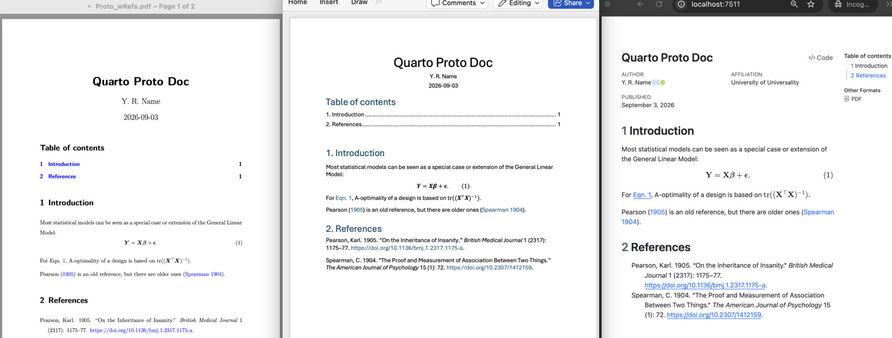

# I ♥ Quarto

As a statistician that collaborates with with non-technical scientists, I've always struggled with how to write collaboratively. Overleaf is great, but only if you're LaTeX native. Word and Google Docs equations are actually not bad, typesetting based on LaTeX conventions, but they're quirky and very awkward with search/replace. Another challenge is capturing mathematical output from chatbots to edit and incorporate into documents.

My solution: Quarto (https://quarto.org), a generalisation of Rstudio's Rmarkdown. 

While some might know Quarto as a notebook that can integrate R & Python, I treasure it as a way of quickly composing documents in a text editor which I can then render to PDF, Word docx, HTML, etc.  I also use it to capture useful mathematical output from a chatbot for subsequent editing (note, some chatbots use `\( \)` and `\[ \]` for math which isn't LaTeX but works fine with Quarto -- with the `markdown+tex_math_single_backslash` option; see my templates below). And when a collaborator using Word wants material for a methods section, I can write the methods in a Quarto document and then send the docx-rendered version.

For full-length technical journal papers, I'm still using LaTeX/Overleaf, but when I need to quickly iterate on a method with a collaborator, it's the fastest way to combine prose and math.

If you want to give it a try, get Quarto from https://quarto.org/docs/get-started ... you can use it completely from within Rstudio or VScode, but I prefer using a text editor and then rendering from a command line script that generates PDF+Word+HTML (see [qmdRender.sh](./qmdRender.sh); it may seem excessive to render all three, and usually I only use the PDF and docx, but large figures often look best in HTML.

# Templates

These are templates that I use everyday and I hope you find them useful

* [Proto.qmd](./Proto.qmd) - Illustrates a multi-section document with bold math and how to label and reference equations  
Output: [Proto.pdf](Output/Proto.pdf?raw=1) | [Proto.docx](Output/Proto.docx?raw=1) | [Proto.html](Output/Proto.html?raw=1) 
* [Proto_wRefs.qmd](./Proto_wRef.qmd) - [Proto_wRefs.bib](./Proto_wRef.bib) - Same as prevoius, but with bibliographic references  
Output: [Proto_wRefs.pdf](raw/refs/heads/main/Output/Proto_wRefs.pdf) | [Proto.docx](raw/refs/heads/main/Output/Proto_wRefs.docx) | [Proto_wRefs.html](raw/refs/heads/main/Output/Proto_wRefs.html) 

* [qmdRender.sh](./qmdRender.sh) - Bash script to render to PDF, Word & HTML

# Math content from chatbots

Direct copy of chatbot responses (i.e. with the copy button) doesn't always produce valid Markdown compatible with Quarto. With the `tex_math_single_backslash` option in header, the back-slash in-line math like `\(\sin(x)/x\)` and display math with `\[ \frac{\sin(x)}{n} \neq si x = 6 \]` renders fine with Quarto.

All of this is subject to change, but as of September 2026:

* **Claude**, **Gemini**:  
'Copy' button produces fully qualified Quarto markdown with `$ $` and `$$ $$`.
* **ChatGPT**, **DeepSeek**,  **Perplexity**:  
'Copy' button produces Quarto-compatible Markdown, with `\( \)` and `\[ \]`.
* **Copilot**:  
'Copy' button produces text with mix of LaTeX and unicode Greek letters; add to prompt "`issue response formatted for Quarto markdown`", or on next prompt "`reissue previous response formatted for Quarto markdown`".

